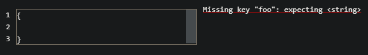
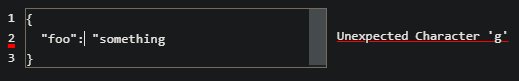
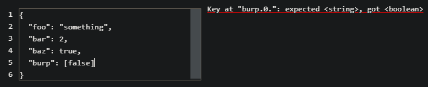
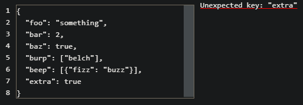

# About

Most of us have had to build web forms that capture input that gets sent as JSON to a backend REST API.

Most of the time, this is fine, but what happens when the input gets kinda... large?

What if the data the API needs is deeply nested or of arbitrary length such as an array of objects.

You _could_ implement a click adventure for appending keys/values or entries in an array using `<input>` and `<button>` elements, or you could use `<StructArea>`

## StructArea

`<StructArea>` is essentially a `<textarea>` for structured JSON data with built-in validation, showing the user what's missing from the required JSON. It also _tries it's best_ to highlight lines containing JSON syntax errors.

Now I know, this doesn't seem like a very useful end-user form field. This is geared more towards types of users that can read JSON. If you're like me and find yourself implementing UI's that start to get cramped, and your target user base is dev/engineering, consider `<StructArea>` for the complicated pieces.

### Install

`npm i @prospectfive/structarea`

### Example

```jsx
import React, { useState } from 'react'
import { StructArea } from '@prospectfive/structarea'

export const MyForm = () => {
  const [content, setContent] = useState('')

  const handleOnChange = (e) => {
    setContent(e.target.value)
  }

  return (
    <div>
      {/* other form fields */}
      <StructArea
        minWidth={300}
        value={content}
        onChange={handleOnChange}
        struct={{
          foo: 'a',
          bar: 1,
          baz: true,
          burp: ['one'],
          beep: [{ fizz: 'buzz' }],
        }}
      >
    </div>
  )
}
```

### Missing Key



### Parse Error



### Unexpected Type



### Extra Key


